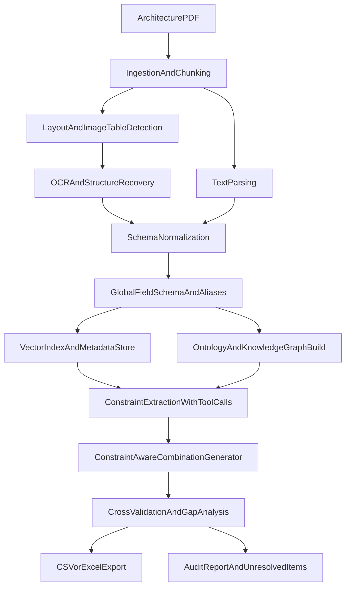

# Implementation Plan for NPU Command Combination Extraction

## 1) Objective

Architecture PDF에서 NPU 명령어/필드/제약을 빠짐없이 추출하고, 허용 가능한 필드 조합만으로 구성된 단일 Test Case 테이블(CSV/Excel)을 생성한다.  
핵심 목표는 **정확성, 완전성, 추적성**이며 Verilog 생성은 수행하지 않는다.
운영 원칙은 **오픈소스 우선, 상용 서비스 사용 불가, LLM API 최소 호출**이다.

용어 구분 원칙:
- `DataType`은 값의 형식/표현
- `ValueDomain`은 해당 타입에서 허용되는 값의 집합/범위
- 파이프라인 전 단계에서 두 개념을 분리 저장한다.

## 2) Target Deliverables

- 최종 산출:
  - `npu_testcase_table.csv` 또는 `npu_testcase_table.xlsx`
- 검증/추적 산출:
  - 추출 근거 메타데이터 저장소
  - 제약 규칙 저장소
  - 누락/불확실 항목 리포트
  - 커버리지 리포트(명령어/필드/제약 기준)

## 3) System Architecture (Proposed)

## 4) Data and Storage Design

- **Vector DB (RAG 용도)**:
  - 문단/표/OCR 블록 임베딩 저장
  - 검색 시 source metadata(page, bbox, extraction method) 반환
- **Ontology + Knowledge Graph/Graph DB**:
  - 노드: IP, ExecutionUnit, Instruction, Field, DataType, ValueDomain, Constraint, ConstraintType, Metadata, Evidence, ExtractionRun
  - 엣지 예시:
    - `IP HAS_INSTRUCTION Instruction`
    - `Instruction EXECUTES_ON ExecutionUnit` (또는 `BELONGS_TO_UNIT`)
    - `Instruction HAS_FIELD Field`
    - `Field HAS_DATATYPE DataType` (`data_type_ref` → 레지스트리 `type_id`)
    - `Field HAS_DOMAIN ValueDomain`
    - `Constraint APPLIES_TO Field`
    - `Constraint DEPENDS_ON Field`
    - `Constraint INSTANCE_OF ConstraintType`
    - `Instruction HAS_METADATA Metadata`
    - `Field HAS_METADATA Metadata`
    - `Constraint HAS_METADATA Metadata`
    - `Entity EXTRACTED_BY ExtractionRun`
    - `Entity SUPPORTED_BY Evidence`
- **정형 테이블 저장소**:
  - 최종 조합 생성 및 내보내기 전 중간 정규화 테이블 관리

## 5) Step-by-Step Development Plan

## Step 0. Environment and Pipeline Skeleton
- PDF 파싱, OCR, 테이블 인식, 임베딩, 그래프 저장, CSV/Excel 내보내기 구성
- 공통 스키마 정의:
  - `instruction`, `field`, `constraint`, `evidence`, `test_case`
- 모든 레코드에 `trace_id`와 `source_refs` 필수화

## Step 1. Document Ingestion and Segmentation
- PDF 페이지 단위 추출 및 텍스트 레이어 유무 판별
- 페이지 내 블록 분리:
  - 본문, 표, 그림(삽입 이미지), 수식 영역
- OCR 필요 페이지 자동 라우팅
- 출력:
  - `page_blocks` (block_type, block_id, page, bbox, raw_text, confidence; 선택: `relationships`)

## Step 2. Instruction Candidate Extraction
- 명령어 패턴 사전 + LLM tool call로 명령어명 후보 추출
- 중복/동의어 정규화(표기 차이 통합)
- 명령어별 근거 링크 유지
- 각 명령에 대해 **OPCODE**(`opcode_raw`, `opcode_radix`, `opcode_value`)·**실행 유닛(`execution_unit`)**·**macro/micro 구분(`instruction_kind`)** 추출(불명확 시 `unknown`/null)
- 출력:
  - `instruction_catalog`

## Step 3. Field Structure Extraction from Tables/Images
- 표 인식 + OCR + 레이아웃 기반으로 비트/워드/필드명 복구 (필드 표에 **데이터 타입이 없을 수 있음** — 이름·비트 위치 중심)
- 이미지 표는 셀 단위 구조 복원 시도
- 불완전 셀은 `uncertain` 플래그와 근거 저장
- 출력:
  - `instruction_field_map` (instruction, field, bit_range, word, evidence)

## Step 3b. Global Unique Field Set and Aliases
- `instruction_field_map`에서 **전역 unique 필드 이름 집합**을 확정하고 `canonical_field_names`로 고정
- 동의어·표기 차이를 `field_alias_map`으로 수집(초기는 빈 목록 가능, 후속으로 용어집/fuzzy/수동 검토)
- Step 4·5에서 필드 문자열을 canonical 이름으로 정규화하는 기준으로 사용
- 출력:
  - `global_field_schema`
  - `field_alias_map`

## Step 4. Data Type and Value Domain Extraction
- 문서 전역에서 **데이터 타입 명칭 전체 집합**을 수집해 `datatype_registry`에 등록한다(일반 `uintN`/열거 외 **IP 아키텍처 전용 타입** 포함).
- 각 타입에 대해 TRM에 기술된 **값 범위·예약값·값 생성/인코딩 규칙**을 추출해 `value_constraint_summary`, `value_generation_method` 등으로 저장한다.
- 필드별로 표에 나온 타입 문자열(`data_type_raw`)을 `datatype_registry.type_id`에 매핑한 **`data_type_ref`**로 연결한다(표에 타입이 없으면 본문·용어 장·별도 표에서 역추적).
- **`global_field_schema`의 canonical 필드명**과 정렬하여 동일 필드에 대한 서술을 조인
- 필드별 허용값, 범위, 형식(enum/range/mask/formula) 추출
- 정규표현식 + LLM tool call 하이브리드 파싱(토큰 최소화 정책 준수)
- 표현 통합:
  - 예: `0x0~0xF`, `[0,15]`, `4-bit unsigned`를 공통 도메인 형태로 변환
- 출력:
  - `datatype_registry`
  - `field_domain_catalog`
  - `field_datatype_catalog`

## Step 5. Constraint Mining (Scattered Rules)
- **`global_field_schema` / `field_alias_map`**을 사용해 제약 문장 속 필드 지칭을 canonical 필드명으로 정규화
- 문서 전역에서 제약 후보 문장 탐지(RAG 검색 + 재랭킹)
- 제약 유형을 사전 고정하지 않고 문맥에서 후보를 수집/클러스터링
- 제약 온톨로지 매핑 단계 수행:
  - L1: range/enum/cardinality/conditional/dependency
  - L2: mutual-exclusion/implication/reserved-value/encoding/instruction-specific
- 매핑 불가 항목은 `unclassified_constraint`로 보존
- 기계 실행 가능한 규칙식으로 변환하고 원문 근거 연결
- 출력:
  - `constraint_registry`
  - `constraint_type_catalog`
  - `constraint_classification_report`

## Step 6. Constraint-Aware Combination Generation
- 입력: `global_field_schema`(컬럼 순서·전역 필드 집합), `field_domain_catalog`, `constraint_registry` 등
- **`canonical_field_names`를 열 집합으로 사용**하여 행(테스트 케이스) 생성
- 명령어별 미사용 필드는 Don't Care 정책 적용
- 명령어별 기본 조합 공간 생성
- 제약 기반 프루닝:
  - 상충 규칙 제거
  - 조건부 필드 활성/비활성 반영
- 생성 결과에 `constraint_satisfaction_status` 기록
- 출력:
  - `test_case_matrix`

## Step 7. Validation and Gap Detection
- 내부 일관성 검증:
  - 필드 타입-값 불일치 탐지
  - 의존성 위반 탐지
  - 제약 타입 분류 불확실/미분류 항목 탐지
- 외부 검증(선택):
  - 엑셀 원본과 교차 비교
  - PDF 우선 원칙 위반 여부 리포트
- 누락/불확실 항목 집계:
  - 페이지 단위 unresolved list 생성

## Step 8. Export and Human Review Package
- CSV/Excel 산출
- 함께 제공:
  - 제약 목록
  - 근거 메타데이터 파일
  - unresolved report
  - 커버리지 요약

## 6) Tooling Strategy

- **Advanced RAG**:
  - 문단/표/OCR 결과를 통합 인덱싱하고 evidence-aware retrieval 수행
- **Tool Calls (LLM Orchestration)**:
  - 명령어 추출, 제약식 변환, 충돌 규칙 탐지 등 단계별 호출
- **Vector DB**:
  - 분산된 제약 문장 검색과 근거 추적의 중심 저장소
- **Ontology/Knowledge Graph/Graph DB**:
  - 필드 간 의존성과 제약 관계를 구조적으로 저장/질의
  - 복합 조건 검증과 영향도 분석 지원
  - `ConstraintType` 온톨로지 기반 분류 및 명령어/필드별 제약 종류 집계 지원

## 6.4) OSS-First Stack and Minimal LLM API Policy

### Commercial services prohibition
- 외부 **상용 SaaS**, **유료 클라우드 전용 서비스**, **상용 유료 API**는 사용하지 않는다.
- 벡터 DB·그래프 DB 등은 **자체 호스팅 가능한 오픈소스**(예: `faiss`/`pgvector`, `neo4j` 커뮤니티 에디션 자체 구축 등)만 사용한다.
- 사내 LLM API는 회사 정책상 허용되는 경우에 한해 **최소 호출**로만 사용한다(외부 상용 LLM API와 별개로 취급).

### Open-source preferred components
- PDF parsing/layout: `PyMuPDF`, `pdfplumber`, `pypdfium2`
- OCR: `Tesseract` + `PaddleOCR` (페이지 특성별 선택)
- Table/image-table extraction: `img2table`, `camelot`/`tabula`(텍스트 표), OpenCV 기반 셀 분할
- NLP/IR: `sentence-transformers`, `faiss`, `rank-bm25`, `rapidfuzz`
- Knowledge graph: `networkx`(초기), `neo4j`/`arangodb`(확장 시)
- Data processing: `pandas`, `polars`, `pydantic`, `jsonschema`

### LLM API usage minimization rules
1. 규칙/파서/OCR/IR로 해결 가능한 작업에는 LLM 호출 금지
2. LLM은 아래 고난도 작업에만 제한 사용
   - 비정형 제약 문장 정규화
   - ambiguous한 제약 분류 보정
   - 충돌 규칙 설명 생성
3. 2단계 게이트 후 호출
   - Gate-1: rule-based confidence 낮음
   - Gate-2: retrieval evidence 충분
4. 배치 호출/짧은 컨텍스트/캐시(`prompt+evidence hash`)로 토큰 최소화
5. 호출마다 토큰 사용량/근거/결과를 `ExtractionRun` 메타로 기록

### API interface guideline
- 사내 LLM API는 OpenAI-compatible(OpenAPI-style REST) 인터페이스를 기본 가정
- 코드 레벨은 `base_url`, `api_key`, `model`만 교체하면 동작하도록 provider abstraction 유지
- 기본 설계는 향후 API endpoint 교체에 무변경 또는 최소변경을 목표로 함

## 6.1) Constraint Ontology Flow

1. 제약 후보 추출: 문서 전역에서 후보 문장/표 캡처
2. 의미 정규화: 자연어를 규칙식 후보로 변환
3. 클러스터링: 유사 제약을 패턴 단위로 묶음
4. 온톨로지 매핑: `ConstraintType` 계층에 자동 분류
5. 근거 연결: 분류 결과마다 원문 근거와 신뢰도 저장
6. 미분류 관리: `unclassified_constraint` 큐로 수동 검토
7. 적용대상 집계: `Instruction`/`Field`별 제약 종류 분포 생성

## 6.1.1) Mission Ontology Scope

제약 온톨로지는 미션 온톨로지의 일부이며, 저장 대상은 아래를 모두 포함한다.

- `IP` (ip_name, ip_type, ip_version, ip_additional_info)
- `ExecutionUnit` (하드웨어 실행 블록; instruction_catalog의 `execution_unit`과 연결)
- `Instruction` (명령어 엔티티; 고유 식별 `opcode_value`/`opcode_raw`; `instruction_kind`: macro/micro/unknown)
- `Field` (비트/워드 위치 포함)
- `DataType` / 타입 레지스트리 노드(문서에서 수집한 `type_id`; primitive·IP 전용 구분)
- `ValueDomain` (타입 위에서 필드별 허용값 집합/범위/인스턴스 규칙)
- `Constraint` (규칙 본문)
- `ConstraintType` (제약 종류 계층)
- `Metadata` (페이지, 블록, bbox, 추출 방식, 신뢰도, 버전)
- `Evidence` (원문 근거 단위)
- `ExtractionRun` (실행 단위 계보 정보)

핵심 질의 예시:
- ExecutionUnit별 명령어 집합 조회
- IP별 명령어 집합과 버전별 차이 조회
- 명령어별 필드 구성과 필드별 타입/도메인 조회
- `datatype_registry` 기준 타입 전체 목록 및 IP 전용 타입만 필터 조회
- 필드별 제약 종류 분포 조회
- 특정 제약의 근거 페이지/블록 및 추출 실행 이력 조회

## 6.2) Project Folder Strategy

단계별 실험과 통합 코드를 분리해, 다양한 방법을 병렬 검증한 뒤 통합 파이프라인에 반영한다.

- `src/stage1_ingestion`
- `src/stage2_instruction_extraction`
- `src/stage3_field_table_parsing`
- `src/stage3b_global_field_schema`
- `src/stage4_domain_typing`
- `src/stage5_constraint_ontology`
- `src/stage6_combination_generation`
- `src/stage7_validation_reporting`
- `src/integration_pipeline`
- `experiments/` (대안 기법/모델 비교)
- `data_contracts/` (단계 간 입출력 스키마)

## 6.3) Stage Interface Contracts

각 단계는 아래 계약을 만족해야 한다.

- 입력 스키마 버전 명시 (`input_schema_version`)
- 출력 스키마 버전 명시 (`output_schema_version`)
- 최소 공통 메타 필드 포함:
  - `trace_id`, `source_refs`, `confidence_score`, `stage_name`, `stage_run_id`
- 재실행 재현성:
  - 파라미터/모델/프롬프트 버전 기록

## 7) Metadata and Traceability Policy

모든 핵심 레코드는 아래 메타정보를 가져야 한다.

- `ip_name`
- `ip_type`
- `ip_version`
- `ip_additional_info`
- `document_id`
- `page_number`
- `block_id` / `bbox`
- `extraction_method` (text, ocr, table, image-table)
- `confidence_score`
- `parser_version`
- `timestamp`

추가로 제약 항목은 `rule_origin_text`와 `normalized_expression`을 함께 저장한다.
제약 분류 항목은 `constraint_type_level1`, `constraint_type_level2`, `classification_rationale`를 함께 저장한다.

## 7.1) Stage Documentation Governance

`doc` 폴더에 단계별 문서를 아래 규칙으로 유지한다.

- 파일 패턴:
  - `doc/stageN_<name>_plan.md`
  - `doc/stageN_<name>_status.md`
  - `doc/stageN_<name>_technical_note.md`
- 통합 파이프라인:
  - `doc/integration_plan.md`
  - `doc/integration_status.md`
  - `doc/integration_technical_note.md`
- 운영 규칙:
  - `plan`: 목표, 범위, 입출력 계약, 수용 기준
  - `status`: 구현률, 검증 결과, 미해결 이슈, 다음 액션
  - `technical_note`: 알고리즘 선택 근거, 실패 케이스, 트레이드오프

## 8) Quality Gates

- Gate A: 명령어 목록 커버리지 100% (미확정 항목은 unresolved 등록 필수)
- Gate B: 필드 스키마 충돌 0건
- Gate C: 제약식 파싱 실패 항목 전수 식별
- Gate D: 최종 테이블의 모든 셀에 값 또는 Don't Care가 존재
- Gate E: 모든 주요 엔티티가 source evidence를 참조
- Gate F: 각 제약이 온톨로지 타입 또는 `unclassified_constraint`로 분류됨
- Gate G: 단계별 문서(plan/status/technical_note)가 최신 상태로 유지됨
- Gate H: LLM API 호출이 정책 한도 내(고난도 케이스 한정)로 유지되고 호출 로그가 남음

## 9) Risks and Mitigations

- **이미지 기반 표 인식 실패**
  - 다중 OCR 엔진/설정 재시도, 셀 구조 복원 규칙 적용
- **제약 문장 분산 및 비정형 표현**
  - RAG 기반 후보 수집 후 규칙 템플릿 분류
- **표기법 불일치로 인한 중복 필드**
  - ontology 동의어 사전 + 수동 승인 큐
- **조합 폭발**
  - 제약 우선 프루닝, 경계값/대표값 전략 병행

## 10) Execution Milestones

- M1: Ingestion/OCR/레이아웃 분리 완료
- M2: 명령어/필드/전역 필드 스키마/도메인 추출 1차 완료
- M3: 제약 추출 및 그래프 구축 완료
- M4: 조합 생성기 + 검증기 완료
- M5: CSV/Excel + 감사 리포트 패키지 완료

## 11) Acceptance Checklist

- [ ] 모든 명령어가 최종 테이블에 포함됨
- [ ] 전체 unique 필드 컬럼이 구성됨
- [ ] 제약 기반으로 유효 조합만 반영됨
- [ ] Don't Care 규칙이 명확히 적용됨
- [ ] 메타정보로 원문 근거 추적 가능함
- [ ] 미추출/불확실 항목이 명시적으로 식별됨
- [ ] 제약 종류가 명령어/필드별로 구분 조회 가능함
- [ ] 단계별 실험과 통합 파이프라인 비교가 재현 가능함
